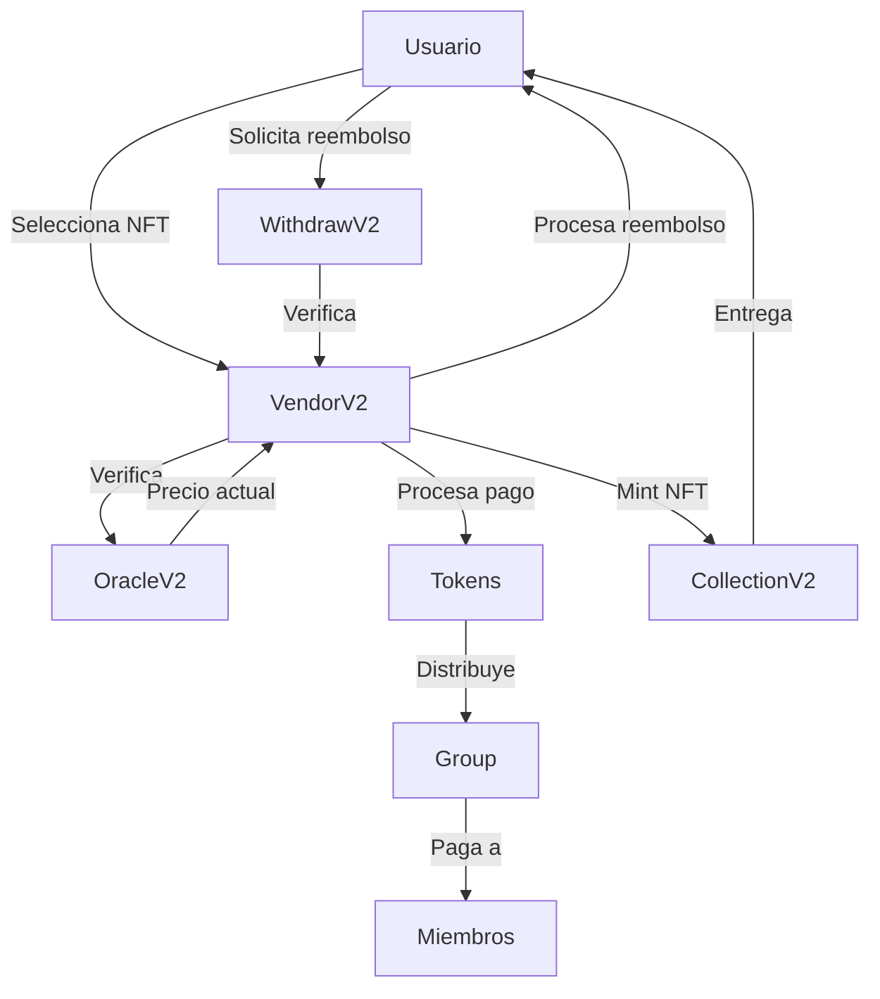

# INHABIT Vendor NFT - Plataforma de Venta de NFTs

## 📋 Descripción General

INHABIT Vendor NFT es una plataforma descentralizada que permite la venta de NFTs de múltiples colecciones, aceptando pagos en diferentes tokens ERC20 y tokens nativos (como ETH, MATIC, CELO). La plataforma incluye funcionalidades avanzadas como distribución de ingresos, sistema de reembolsos y gestión de roles.

## 🚀 Características Principales

- **Venta de NFTs**: Compra de NFTs de diferentes colecciones
- **Múltiples Métodos de Pago**: Acepta tokens ERC20 y tokens nativos
- **Sistema de Reembolsos**: Opción de devolución de NFTs con reembolso
- **Distribución de Ingresos**: Reparto automático de ganancias entre grupos
- **Gestión de Roles**: Sistema de permisos para administradores y usuarios
- **Oracles de Precios**: Integración con Chainlink para precios en tiempo real

## 📚 Documentación Detallada de Contratos

### 1. VendorV2.sol - Contrato Principal

#### Funcionalidades Principales
- **Compra de NFTs**
  ```solidity
  function buyWithToken(
      string calldata _group,    // Grupo para distribución
      address _token,            // Token de pago
      uint256 _cIdx,            // ID de la colección
      uint256 _amount           // Cantidad a comprar
  )
  ```
  - Compra con tokens ERC20
  - Verifica saldo y aprobaciones
  - Distribuye fondos según grupo

- **Compra con Token Nativo**
  ```solidity
  function buyNative(
      string calldata _group,
      uint256 _cIdx,
      address _token,
      uint256 _amount
  ) external payable
  ```
  - Compra con ETH/MATIC/CELO
  - Maneja pagos nativos
  - Distribuye fondos

- **Sistema de Reembolsos**
  ```solidity
  function refundInvestment(
      uint256 _cIdx,    // ID de la colección
      address _token,    // Token usado en la compra
      uint256 _nftId    // ID del NFT a devolver
  )
  ```
  - Devuelve NFTs y reembolsa fondos
  - Verifica propiedad y estado
  - Maneja tokens ERC20 y nativos

### 2. CollectionV2.sol - Gestión de Colecciones

#### Estructuras
```solidity
struct CollectionStruct {
    address addr;    // Dirección del contrato NFT
    uint256 price;   // Precio en USD
    bool active;     // Estado de la colección
}

struct CollectionIndexStruct {
    address addr;
    uint256 index;
}
```

#### Funciones Principales
- **Gestión de Colecciones**
  ```solidity
  function addCollection(
      address _addr,    // Dirección del NFT
      uint256 _pr,      // Precio en USD
      bool _act         // Estado activo
  )
  ```
  - Añade nuevas colecciones
  - Actualiza precios y estados
  - Mantiene índice de colecciones

### 3. OracleV2.sol - Sistema de Precios

#### Funcionalidades
- **Conversión de Precios**
  ```solidity
  function parseUSDtoToken(
      uint256 _amount,    // Cantidad en USD
      address _token,     // Token destino
      bool _isNative      // Si es token nativo
  )
  ```
  - Convierte USD a tokens
  - Maneja diferentes decimales
  - Integra con Chainlink

- **Obtención de Precios**
  ```solidity
  function getUSDPrice(address _addr)
  ```
  - Obtiene precios de Chainlink
  - Verifica tokens permitidos
  - Ajusta decimales

### 4. Group.sol - Distribución de Ingresos

#### Estructuras
```solidity
struct GroupStruct {
    string group;
    bool state;
    Shared[] arrayShared;
}

struct Shared {
    address addr;
    uint256 pcng;
}
```

#### Funciones Principales
- **Gestión de Grupos**
  ```solidity
  function addGroup(
      string calldata _group,
      bool _state,
      Shared[] memory _groups
  )
  ```
  - Crea grupos de distribución
  - Asigna porcentajes
  - Gestiona miembros

- **Distribución de Fondos**
  ```solidity
  function distribution(
      string calldata _group,
      uint256 _amount,
      bool _isNative,
      address tokenAddrs
  )
  ```
  - Distribuye fondos automáticamente
  - Maneja tokens ERC20 y nativos
  - Registra eventos

### 5. Administered.sol - Control de Acceso

#### Roles y Permisos
```solidity
bytes32 public constant USER_ROLE = keccak256("USER");
```

#### Funciones Principales
- **Gestión de Roles**
  ```solidity
  function addAdmin(address account)
  function addUser(address account)
  function removeUser(address account)
  ```
  - Control de acceso granular
  - Herencia de permisos
  - Seguridad basada en roles

### 6. WithdrawV2.sol - Gestión de Retiros

#### Funciones Principales
- **Retiro de Fondos**
  ```solidity
  function withdraw(
      uint256 _amount,
      address _to
  )
  function withdrawToken(
      address _token,
      uint256 _amount,
      address _to
  )
  ```
  - Retiro de tokens nativos
  - Retiro de tokens ERC20
  - Seguridad en transacciones

## 🔧 Configuración Técnica

### Requisitos
- Node.js 14+
- Hardhat
- Dependencias:
  - OpenZeppelin Contracts
  - Chainlink Oracles

### Instalación
```bash
npm install
```

### Despliegue
```bash
npx hardhat run scripts/deploy.js --network <red>
```

## 🔒 Seguridad

- **ReentrancyGuard**: Protección contra ataques de reentrada
- **AccessControl**: Sistema de roles y permisos
- **Validaciones**: Comprobaciones de saldo y aprobaciones
- **SafeMath**: Operaciones matemáticas seguras

## 🧪 Testing

El proyecto incluye contratos mock para testing:
- `MockOracleV2.sol`: Simula oráculos de precios
- `MockErc20.sol`: Simula tokens ERC20

## 🤝 Contribución

1. Fork del repositorio
2. Crear rama de características (`git checkout -b feature/AmazingFeature`)
3. Commit de cambios (`git commit -m 'Add some AmazingFeature'`)
4. Push a la rama (`git push origin feature/AmazingFeature`)
5. Abrir Pull Request

## 📝 Licencia

Distribuido bajo la licencia MIT. Ver `LICENSE` para más información.

## 📞 Contacto

Para consultas técnicas o soporte, contactar al equipo de desarrollo.

## ⚙️ Configuración del Sistema

### 1. Configuración Inicial del Contrato

#### 1.1 Despliegue del Contrato
```bash
# Compilar
npx hardhat compile

# Desplegar
npx hardhat run scripts/deploy.js --network <red>
```

#### 1.2 Configuración de Roles
```solidity
// Configurar administradores
vendor.addAdmin(0x123...);  // Dirección del administrador

// Configurar usuarios
vendor.addUser(0x456...);   // Dirección del usuario
```

### 2. Configuración de Tokens

#### 2.1 Configurar Token Nativo (ETH/MATIC/CELO)
```solidity
// Ejemplo para ETH en Ethereum Mainnet
vendor.addToken(
    0xEeeeeEeeeEeEeeEeEeEeeEEEeeeeEeeeeeeeEEeE, // Dirección ETH
    0x5f4eC3Df9cbd43714FE2740f5E3616155c5b8419, // Feed ETH/USD
    8,                                           // Decimales del feed
    true,                                        // Activo
    true                                         // Es nativo
);
```

#### 2.2 Configurar Tokens ERC20
```solidity
// Ejemplo para USDC en Ethereum Mainnet
vendor.addToken(
    0xA0b86991c6218b36c1d19D4a2e9Eb0cE3606eB48, // Dirección USDC
    0x8fFfFfd4AfB6115b954Bd326cbe7B4BA576818f6, // Feed USDC/USD
    8,                                           // Decimales del feed
    true,                                        // Activo
    false                                        // No es nativo
);
```

### 3. Configuración de Colecciones NFT

#### 3.1 Añadir Nueva Colección
```solidity
// Ejemplo de configuración de colección
vendor.addCollection(
    0x123...,  // Dirección del contrato NFT
    1000000,   // Precio en USD (100.00 USD)
    true       // Activo
);
```

#### 3.2 Actualizar Colección Existente
```solidity
// Actualizar precio
vendor.updateCollection(
    0,         // ID de la colección
    1,         // Tipo: 1 = precio
    0x0,       // Dirección (no aplica)
    1500000,   // Nuevo precio (150.00 USD)
    false      // Estado (no aplica)
);
```

### 4. Configuración de Grupos

#### 4.1 Crear Grupo de Distribución
```solidity
// Estructura para miembros del grupo
Shared[] memory members = new Shared[](2);
members[0] = Shared(0x123..., 5000); // 50% para dirección 1
members[1] = Shared(0x456..., 5000); // 50% para dirección 2

// Crear grupo
vendor.addGroup(
    "team",    // Nombre del grupo
    true,      // Activo
    members    // Miembros y porcentajes
);
```

#### 4.2 Actualizar Grupo
```solidity
// Actualizar estado del grupo
vendor.updateGroupStatus("team", false);

// Añadir nuevo miembro
Shared memory newMember = Shared(0x789..., 2500);
vendor.addSharedOfGroup("team", newMember);
```

### 5. Configuración de Reembolsos

#### 5.1 Activar Sistema de Reembolsos
```solidity
// Activar globalmente
vendor.setRefundActive(true);

// Habilitar para wallet específica
vendor.setRefundEnabled(0x123..., true);
```

### 6. Configuración de Seguridad

#### 6.1 Verificar Permisos
```solidity
// Verificar roles
require(vendor.isAdmin(msg.sender), "No es administrador");
require(vendor.isUser(msg.sender), "No es usuario");
```

#### 6.2 Configurar Límites
```solidity
// En el contrato NFT
function mintReserved(address to, uint256 amount) external {
    require(msg.sender == vendorAddress, "Solo vendor puede mintear");
    // Lógica de minting
}
```

### 7. Flujo de Operación

#### 7.1 Compra de NFT
```solidity
// Compra con USDC
usdc.approve(vendorAddress, 1000000); // Aprobar gasto
vendor.buyWithToken(
    "team",      // Grupo para distribución
    usdcAddress, // Token de pago
    0,           // ID de la colección
    1            // Cantidad
);

// Compra con ETH
vendor.buyNative{value: 100000000000000000}(
    "team",      // Grupo para distribución
    0,           // ID de la colección
    ethAddress,  // Dirección ETH
    1            // Cantidad
);
```

#### 7.2 Reembolso de NFT
```solidity
// Solicitar reembolso
vendor.refundInvestment(
    0,           // ID de la colección
    usdcAddress, // Token usado
    123          // ID del NFT
);
```

### 8. Monitoreo y Mantenimiento

#### 8.1 Verificar Estados
```solidity
// Verificar estado de colección
(bool active, uint256 price) = vendor.getCollection(0);

// Verificar balance de tokens
uint256 balance = IERC20(tokenAddress).balanceOf(vendorAddress);
```

#### 8.2 Actualizaciones de Precios
```solidity
// Verificar precio actual
uint256 price = vendor.getUSDPrice(tokenAddress);

// Actualizar feed si es necesario
vendor.updateToken(
    tokenId,
    1,          // Tipo: 1 = actualizar oracle
    newOracle,  // Nueva dirección del oracle
    0,          // Decimales (no aplica)
    false       // Estado (no aplica)
);
```

### 9. Consideraciones Importantes

1. **Seguridad**
   - Verificar todas las direcciones antes de configurar
   - Usar feeds de precios oficiales de Chainlink
   - Mantener actualizados los permisos de roles

2. **Precisión**
   - Usar decimales correctos para cada token
   - Verificar precios antes de operaciones importantes
   - Mantener balances suficientes para reembolsos

3. **Mantenimiento**
   - Monitorear estados de colecciones
   - Verificar balances regularmente
   - Actualizar feeds de precios cuando sea necesario

4. **Backup y Recuperación**
   - Mantener copias de seguridad de configuraciones
   - Documentar todos los cambios
   - Tener plan de contingencia para emergencias

## 📊 Flujo del Sistema

### 1. Flujo No Técnico

#### 1.1 Para Administradores
1. **Configuración Inicial**
   - Crear cuenta de administrador
   - Configurar tokens aceptados
   - Establecer precios de NFTs
   - Crear grupos de distribución

2. **Gestión de Colecciones**
   - Añadir nuevas colecciones NFT
   - Establecer precios en USD
   - Activar/desactivar colecciones
   - Monitorear ventas

3. **Gestión de Grupos**
   - Crear grupos de distribución
   - Asignar porcentajes a miembros
   - Gestionar cambios en la distribución
   - Verificar pagos realizados

4. **Monitoreo**
   - Revisar ventas diarias
   - Verificar distribuciones
   - Gestionar reembolsos
   - Actualizar precios

#### 1.2 Para Usuarios
1. **Compra de NFTs**
   - Seleccionar colección
   - Elegir método de pago
   - Confirmar compra
   - Recibir NFT

2. **Reembolsos**
   - Solicitar reembolso
   - Esperar confirmación
   - Recibir fondos
   - Devolver NFT

3. **Verificación**
   - Comprobar propiedad
   - Verificar precios
   - Revisar historial
   - Consultar soporte

### 2. Diagrama de Flujo General



### 3. Proceso de Compra

1. **Selección**
   - Usuario elige NFT
   - Selecciona método de pago
   - Verifica precio actual

2. **Pago**
   - Aprobar gasto (ERC20)
   - Enviar fondos
   - Confirmar transacción

3. **Distribución**
   - Calcular comisiones
   - Distribuir a grupos
   - Registrar transacción

4. **Entrega**
   - Mintear NFT
   - Transferir al usuario
   - Confirmar recepción

### 4. Proceso de Reembolso

1. **Solicitud**
   - Usuario solicita reembolso
   - Verificar propiedad
   - Confirmar elegibilidad

2. **Procesamiento**
   - Calcular monto
   - Verificar fondos
   - Preparar reembolso

3. **Ejecución**
   - Devolver NFT
   - Reembolsar fondos
   - Registrar transacción

### 5. Roles y Responsabilidades

#### 5.1 Administrador
- Configurar sistema
- Gestionar colecciones
- Monitorear operaciones
- Resolver problemas

#### 5.2 Usuario
- Comprar NFTs
- Solicitar reembolsos
- Verificar transacciones
- Reportar problemas

#### 5.3 Sistema
- Procesar pagos
- Distribuir fondos
- Gestionar NFTs
- Mantener registros

### 6. Consideraciones de Negocio

1. **Seguridad**
   - Verificar identidades
   - Proteger fondos
   - Prevenir fraudes
   - Mantener registros

2. **Eficiencia**
   - Optimizar procesos
   - Reducir costos
   - Mejorar experiencia
   - Automatizar tareas

3. **Escalabilidad**
   - Manejar crecimiento
   - Adaptar a cambios
   - Mejorar rendimiento
   - Expandir funcionalidades

4. **Soporte**
   - Asistir usuarios
   - Resolver problemas
   - Mantener documentación
   - Proporcionar guías

## 📄 Documentación Técnica del Contrato VendorV2

### 1. Propósito General

El contrato VendorV2 actúa como una plataforma centralizada para la venta de NFTs de diversas colecciones. Permite a los usuarios comprar estos NFTs utilizando tokens ERC20 específicos o el token nativo de la blockchain (ej. ETH, MATIC, CELO). Incorpora funcionalidades robustas para la administración de colecciones, gestión de tokens aceptados, oráculo de precios, distribución de ingresos a grupos, sistema de roles, retiro de fondos y un mecanismo de reembolso opcional.

### 2. Módulos Heredados y Funcionalidad

#### 2.1 Administered (./security/Administered.sol)
- Implementa sistema de control de acceso basado en roles
- Roles principales: Admin y User
- Funciones clave:
  ```solidity
  function addAdmin(address account)
  function removeAdmin(address account)
  function isAdmin(address account)
  function addUser(address account)
  function removeUser(address account)
  function isUser(address account)
  ```

#### 2.2 WithdrawV2 (./helpers/WithdrawV2.sol)
- Lógica para retiro de fondos
- Funciones clave:
  ```solidity
  function withdrawToken(address _token, uint256 _amount, address _to)
  function withdrawNative(uint256 _amount, address _to)
  ```

#### 2.3 ReentrancyGuard
- Prevención de ataques de reentrada
- Modificador `nonReentrant`
- Aplicado en funciones críticas

#### 2.4 CollectionV2 (./factories/CollectionV2.sol)
- Gestión de colecciones NFT
- Estructura:
  ```solidity
  struct CollectionStruct {
      address addr;    // Dirección del contrato NFT
      uint256 price;   // Precio en USD
      bool active;     // Estado de la colección
  }
  ```

#### 2.5 OracleV2 (./helpers/OracleV2.sol)
- Gestión de tokens aceptados
- Integración con Chainlink
- Estructura:
  ```solidity
  struct ERC20List {
      address addr;    // Dirección del token
      address feed;    // Feed de precios
      bool active;     // Estado del token
      bool isNative;   // Si es token nativo
  }
  ```

#### 2.6 Group (./patners/Group.sol)
- Distribución de ingresos
- Gestión de grupos y miembros
- Funciones clave:
  ```solidity
  function addGroup(string calldata _group, bool _state, Shared[] memory _groups)
  function distribution(string calldata _group, uint256 _amount, bool _isNative, address tokenAddrs)
  ```

### 3. Variables de Estado Principales

```solidity
mapping(address => mapping(address => uint256)) public investments;
mapping(address => bool) public refundEnabled;
bool public refundActive;
```

### 4. Funciones Principales

#### 4.1 Transferencia Reservada
```solidity
function transferReserved(
    uint256 _idx,    // ID de la colección
    address _addr,    // Dirección destino
    uint256 _qty     // Cantidad
) external onlyUser nonReentrant
```

#### 4.2 Compra con Token
```solidity
function buyWithToken(
    string calldata _group,    // Grupo para distribución
    address _token,            // Token de pago
    uint256 _cIdx,            // ID de la colección
    uint256 _amount           // Cantidad a comprar
) external nonReentrant
```

#### 4.3 Compra con Token Nativo
```solidity
function buyNative(
    string calldata _group,    // Grupo para distribución
    uint256 _cIdx,            // ID de la colección
    address _token,            // Token nativo
    uint256 _amount           // Cantidad a comprar
) external payable nonReentrant
```

#### 4.4 Funciones de Reembolso
```solidity
function setRefundEnabled(address _wallet, bool _enabled) external onlyAdmin
function setRefundActive(bool _active) external onlyAdmin
function refundInvestment(uint256 _cIdx, address _token, uint256 _nftId) external nonReentrant
```

### 5. Configuración Post-Despliegue

#### 5.1 Añadir Tokens Aceptados
1. Para tokens ERC20:
   ```solidity
   addToken(
       tokenAddress,    // Dirección del token
       feedAddress,     // Feed de precios
       false           // No es nativo
   )
   ```

2. Para token nativo:
   ```solidity
   addToken(
       nativeAddress,   // Dirección representativa
       feedAddress,     // Feed de precios
       true            // Es nativo
   )
   ```

#### 5.2 Añadir Colecciones NFT
```solidity
addCollection(
    nftAddress,    // Dirección del contrato NFT
    priceUSD,      // Precio en USD
    true          // Activo
)
```

#### 5.3 Configurar Grupos
```solidity
addGroup(
    "groupName",    // Nombre del grupo
    true,          // Activo
    members        // Array de miembros
)
```

### 6. Consideraciones de Seguridad

1. **ReentrancyGuard**
   - Protección en funciones críticas
   - Prevención de ataques de reentrada

2. **Control de Acceso**
   - Roles bien definidos
   - Permisos granularizados

3. **Validaciones**
   - Verificación de estados
   - Comprobación de balances
   - Validación de permisos

4. **Manejo de Fondos**
   - Distribución segura
   - Retiros controlados
   - Reembolsos verificados

### 7. Despliegue

1. **Preparación**
   ```bash
   npx hardhat compile
   ```

2. **Despliegue**
   ```bash
   npx hardhat run scripts/deploy.js --network <red>
   ```

3. **Configuración Inicial**
   - Configurar tokens
   - Añadir colecciones
   - Establecer grupos
   - Gestionar roles
